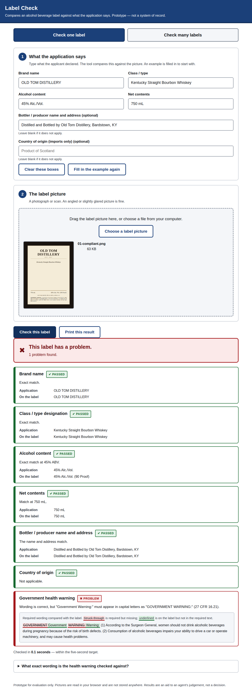

# Label Check — AI-Powered Label Verification

A prototype that checks an alcohol beverage label image against the data in its
COLA application: brand name, class/type, alcohol content, net contents,
bottler address, country of origin, and the mandatory government health
warning. It handles one label at a time or a batch of hundreds.

**Live demo:** see the deployed URL in the submission notes. It runs entirely in the
browser — open it, allow it to use Claude when asked, and upload a label (ten
test labels are in [`samples/`](samples/)).



---

## The one design decision that matters

**The model reads. Code decides.**

A vision model transcribes the label, verbatim, with a confidence score per
field. Every pass/fail judgement is then made by ordinary deterministic code in
[`src/core/`](src/core/) — unit-tested, repeatable, and readable by a
compliance specialist. A regulatory decision that can change between runs, or
that nobody can explain afterwards, isn't usable evidence. "The AI said so" is
not a defensible basis for rejecting an application.

Everything else follows from that. See [`docs/APPROACH.md`](docs/APPROACH.md)
for the full reasoning, mapped to each stakeholder interview.

---

## Quick start

Requires Node 20+ and an Anthropic API key.

```bash
npm install
cp .env.example .env          # then add your ANTHROPIC_API_KEY
npm start                     # http://localhost:3000
```

Or without a `.env` file:

```bash
ANTHROPIC_API_KEY=sk-ant-... npm start
```

### Run the tests

```bash
npm test                      # 37 unit tests over the rules engine
```

The browser smoke test boots the bundled app in headless Chromium with the
model stubbed, so it is deterministic and costs nothing:

```bash
npx playwright install chromium   # once
npm run smoke
```

On a locked-down machine with Chromium already installed, point at it instead
of downloading: `CHROMIUM_PATH=/path/to/chrome npm run smoke`.

### Regenerate the sample labels

```bash
npm run samples
```

Writes ten PNGs to `samples/`, plus `manifest.json` (the expected verdict for
each) and `applications.csv` (ready to load in batch mode).

---

## Using it

**One label.** The form opens with a worked example filled in. Enter what the
application declares, choose the label picture, press **Check this label**.
Each field gets a plain-English result tagged *Passed*, *Review*, or *Problem*.

**Many labels.** Switch to **Check many labels**, choose a folder of pictures,
and optionally load a spreadsheet of application data (rows are matched to
pictures by file name — **Download a blank spreadsheet** gives the headings).
Labels are checked four at a time and results appear as each finishes. **Download
results (CSV)** exports the lot.

**Three verdicts, not two.** *Passed* means unambiguous. *Problem* means a clear
mismatch. *Review* means "a person should look" — a near match, a blurry
photograph, or a value the model wasn't confident it read. The tool never
auto-rejects on a near miss.

---

## Project layout

```
src/core/            The rules engine. Pure functions, no I/O, no network.
  verify.js          Field-by-field verification and the overall verdict
  rules.js           Every TTB value, with its CFR citation — the file to audit
  normalize.js       Typography, case, and punctuation normalization
  similarity.js      Edit-distance and token-set similarity (no dependencies)
  parse.js           ABV and net-contents parsing (proof, cL, fl oz, ...)
  diff.js            Word-level diff for the health warning
src/extract/
  prompt.js          The extraction prompt and output coercion (shared)
  anthropic.js       Server-side vision adapter
public/              The interface (transport-agnostic)
server.js            Express: static files + POST /api/verify
scripts/
  build-artifact.js  Bundles the same modules into the single-file hosted demo
  generate-samples.js
  smoke-test.js
tests/               Unit tests
samples/             Ten synthetic labels with known expected verdicts
docs/                Approach notes and screenshots
```

The hosted demo and the server build run **the same rules engine and the same
interface**. `build-artifact.js` inlines `src/core` and `public/ui.js` into one
HTML file and swaps only the transport — so the two can never drift apart.

---

## Configuration

| Variable | Default | Purpose |
|---|---|---|
| `ANTHROPIC_API_KEY` | — | Required for the server build |
| `TTB_MODEL` | `claude-haiku-4-5-20251001` | Vision model; the default is chosen for latency |
| `PORT` | `3000` | HTTP port |

---

## Assumptions and limits

- **Regulatory values need SME review.** Tolerances and standards of fill in
  [`src/core/rules.js`](src/core/rules.js) are encoded from published CFR
  sections but have not been verified against the current eCFR by counsel.
  They are isolated in one file so that review is a single-file task.
- **Bold type is reported, not scored.** 27 CFR 16.21 requires "GOVERNMENT
  WARNING" in bold. Whether type is bold is a visual judgement the model makes
  less reliably than reading words, so it's shown to the agent but never used
  to auto-fail.
- **Type size and legibility aren't measured.** The regulation sets minimum type
  sizes by container size. A photograph has no reliable scale, so that stays a
  human check.
- **Nothing is stored.** Images are held in memory for one request and discarded.
  There's no database. That's deliberate for a prototype handling applicant
  data; see Marcus Williams's notes in the approach doc.
- **Not integrated with COLA**, per the brief.
- **Network egress.** The server build needs outbound access to the Anthropic
  API. For the agency network, that means one allow-listed host — or a
  self-hosted or Azure-hosted model endpoint, which `src/extract/` is built to swap.
